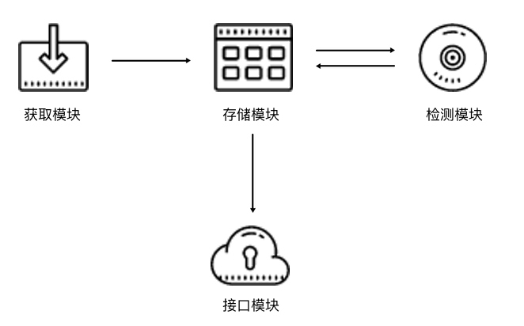

# goProxyPool

## 开发目的

为定向爬虫搭建一个高可用的ip代理池，ip源是自购，未添加获取免费ip源的方法。

## 项目架构

## 检测机制

- 分数 100 为可用，检测器会定时循环检测每个代理的可用情况。一旦检测到有可用的代理，就立即置为 100；如果检测到不可用，就将分数减 10，分数减至 0 后代理移除。

- 新获取的代理的分数为 10，如果测试可行，分数立即置为 100，不可行则将分数减 10，分数减至 0 后代理移除。
- 每隔几分钟做一次ip检测，每次检测分多轮，每轮取50个
